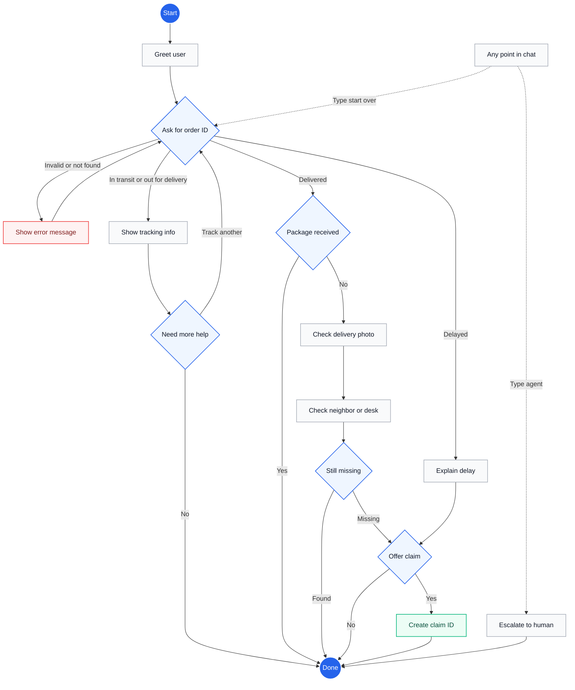

# PackageAssist — Lost Package Support Chatbot

A browser-based customer support chatbot that helps users track shipments, understand delivery status, and file claims for missing packages — all through a clean, stateful conversation interface.

---

## Screenshots for Cases

### 1. Starting the conversation


### 2. Tracking an in-transit package


### 3. Delivered but not received flow
Image 1:


Image 2:


### 4. Claim filed confirmation


### 5. Error handling (invalid order)


## Flowchart


### Tracking an in-transit package

```
Bot: Found it! Here's the latest on your shipment:
     ┌─────────────────────────────────┐
     │ Order ID     EG12345            │
     │ Item         Wireless Headphones│
     │ Status       IN TRANSIT         │
     │ Carrier      FedEx              │
     │ Tracking #   FX-7829341-US      │
     │ Last seen    Dallas, TX         │
     │ Est. arrival Tomorrow by 8 PM   │
     └─────────────────────────────────┘
     Your package is on its way and currently in Dallas, TX.
     Estimated arrival is Tomorrow by 8 PM.

     [ Yes, more help ]  [ No, I'm good ]  [ Track another order ]
```

### Filing a claim for an undelivered package

```
Bot: Done! Your claim has been filed:
     ┌─────────────────────────────────┐
     │ ✓ Claim submitted successfully  │
     │ Claim ID    CLM-X7K2AB          │
     │ Submitted   4/27/2026, 2:15 PM  │
     └─────────────────────────────────┘
     Our team will review the case and contact you within
     24–48 hours with next steps.
```

---

## Features

- **Order lookup** — validates format, queries mock database, and routes by status
- **4 conversation paths** — In Transit, Delivered, Delayed, and Out for Delivery
- **Missing package flow** — guides users through delivery photo → neighbor check → claim filing
- **Claim filing** — generates a unique claim ID with timestamp confirmation
- **Error handling** — invalid formats, unknown order IDs, unclear input
- **Human escalation** — type "agent" at any point to escalate
- **Quick reply buttons** — contextual shortcuts throughout the conversation
- **Typing indicator** — animated dots for realistic response feel

---

## Project Structure

```
package-assist-chatbot/
├── index.html    # App shell and markup
├── style.css     # All styles and animations
├── script.js     # Mock data, state machine, conversation logic
└── README.md     # This file
```

---

## Setup & Installation

No build step, no dependencies, no server required.

**Option 1 — Open directly in browser**

```bash
git clone https://github.com/YOUR_USERNAME/package-assist-chatbot.git
cd package-assist-chatbot
open index.html          # macOS
# or: start index.html   # Windows
# or: xdg-open index.html  # Linux
```

**Option 2 — Local dev server (recommended)**

Using Python:

```bash
cd package-assist-chatbot
python3 -m http.server 3000
# Open http://localhost:3000
```

Using Node.js:

```bash
npx serve .
```

Using VS Code: install the **Live Server** extension, right-click `index.html` → _Open with Live Server_.

---

## Demo Order IDs

| Order ID  | Status           | Description                                     |
| --------- | ---------------- | ----------------------------------------------- |
| `EG12345` | In Transit       | Wireless Headphones — currently in Dallas, TX   |
| `EG22222` | Delivered        | Smart Watch Bundle — delivered today with photo |
| `EG33333` | Delayed          | Office Chair — delayed due to severe weather    |
| `EG44444` | Out for Delivery | Kindle Paperwhite — arriving today              |
| `EG99999` | Not Found        | Triggers the "order not found" error path       |

---

## Approach

### Scenario choice

Lost/missing packages were chosen because the scenario has a clear customer goal, realistic branching logic (different statuses require different responses), and a satisfying resolution path (claim filing). It also demonstrates error handling naturally.

### Architecture

The app uses a **lightweight state machine** instead of a full agent framework. A single `conversationState` object tracks where the user is in the flow:

```js
const conversationState = {
  step: "ask_order_id", // current node in the conversation tree
  currentOrder: null, // resolved order data
  currentOrderId: null, // e.g. "EG12345"
  claimDetails: {}, // populated if a claim is filed
};
```

Each user message is routed through a `switch` on `conversationState.step`, with two global overrides (escalate to agent, restart) that work at any point.

### Mock tools

Two functions simulate real backend calls:

- `lookupOrder(orderId)` — queries the in-memory `mockOrders` object
- `fileClaim(orderId, reason)` — generates a unique claim ID and timestamp

### UX decisions

- **Quick replies** reduce typing friction for common yes/no responses
- **Typing indicator** adds realism and prevents responses feeling instant
- **Inline info cards** present structured data (carrier, tracking, ETA) more clearly than prose
- **Global escape hatches** ("agent", "start over") prevent dead ends
- **Input hint bar** surfaces demo order IDs without cluttering the conversation

---

## Technology

- **HTML/CSS/JS** — no frameworks, no build tools
- **Google Fonts** — DM Sans + DM Mono for a clean, modern feel
- **CSS custom properties** — consistent theming throughout
- **CSS animations** — slide-up messages, typing bounce, status pulse

---

## Future Improvements

- Connect to real carrier APIs (FedEx, UPS, USPS) via a lightweight backend
- Add user authentication to auto-populate order history
- Replace keyword matching with an LLM for intent detection
- Integrate MCP tools for live order and claim management
- Add proactive notifications (e.g. "your package was just delivered")
- Build a live human handoff with agent chat queue
